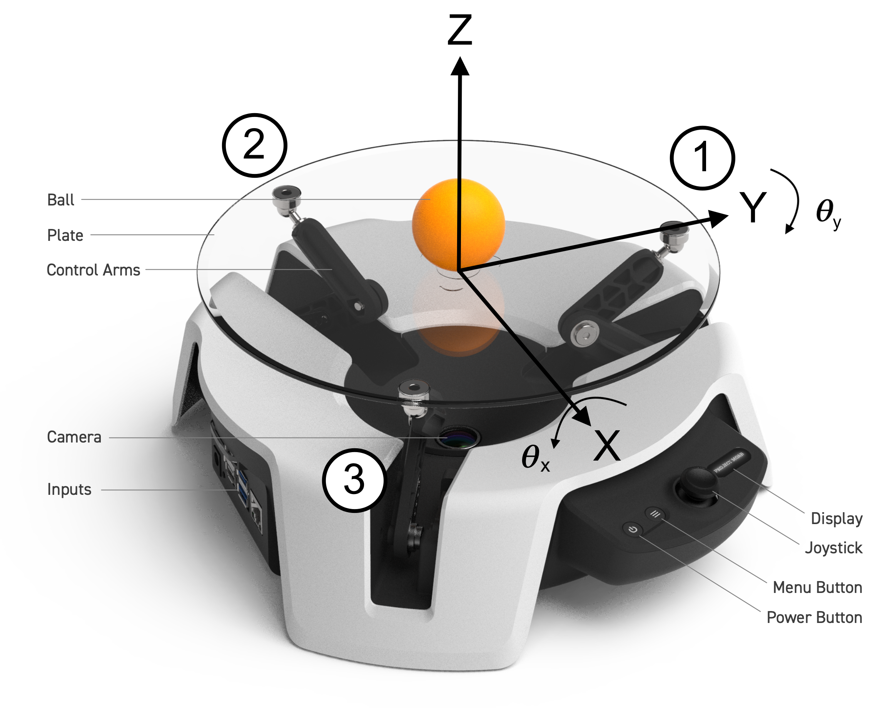

# Moab System Modeling and PID Controller Design

## Abstract

This document details the dynamical analysis of the ball on plate system (MOAB). It lays out the detailed derivations of the equations of motion, PID Controller, and kinematical analysis.

**Keywords**

PID controller, Lagrangian, Kinematic Analysis, Computer Vision

---

## System Introduction

Ball balancing is a challenging controls problem. The ball on plate system is a multi-degree of freedom, nonlinear system whose complexity is comparable to cart-pole and multiple inverted pendulums.

**Figure 1** An isometric view of the ball on plate system with the axes labeled. The figure also shows the linkage configurations numbered.

To understand the ball on plate system, we first look at a simpler ball on beam system. A ball on beam system has two degrees of freedom: the angle of the beam which is actuated by an electric motor and the ball's motion along the beam, which is a function of the angle of the beam. Another inherent property of this system is it's nonlinear nature. The acceleration of the ball due to changes in beam angle has a nonlinear relationship to the ball's position. [1,3]

The ball on plate system can be visualized as an extension to the ball on beam problem. The ball on plate system consists of a plate that can be actuated in two perpendicular directions. The aim is to either stabilize the ball at a desired point on the plate or to make the ball follow a predefined trajectory. The system is designed so the plate is pivoted at the center. This system has four degrees of freedom (two from plate inclinations and two from ball's x and y movement on the plate). The system also carries over the nonlinearities of the ball on beam system mentioned above. 

## Nomenclature

|                  |                                             |
| :----------------| :------------------------------------------ |
| $\theta_y$       | Angle of plate w.r.t. X axis                |
| $\dot \theta_y$  | Angular velocity of plate w.r.t. X axis     |
| $\ddot \theta_y$ | Angular acceleration of plate w.r.t. X axis |
| $\theta_x$       | Angle of plate w.r.t. Y axis                |
| $\dot \theta_x$  | Angular velocity of plate w.r.t. Y axis     |
| $\ddot \theta_x$ | Angular acceleration of plate w.r.t. Y axis |
| $m_b$            | Mass of ping pong ball                      |
| $J_b$            | Moment of inertia of ping pong ball         |
| $r_b$            | Radius of ball                              |
| $v_b$            | velocity of the ball                        |
| $x$              | x position of the ball                      |
| $y$              | y position of the ball                      |
| $\dot x$         | velocity of the ball in x                   |
| $\ddot x$        | acceleration of the ball in x               |
| $\dot y$         | velocity of the ball in y                   |
| $\ddot y$        | acceleration of the ball in y               |

## Assumptions in Dynamical Modelling

To simplify the system modelling, the following assumptions are made:

1. The ball never loses contact with the plate

2. There is no sliding between the ball and the plate

3. Frictional forces are negligible and hence will be neglected

## Equations of Motion - Derivation

Newton's laws are relationships among vectors, which is why they get complicated when we change coordinate systems. The Lagrangian formulation, on the other hand, just uses scalars, and so coordinate transformations tend to be much easier. Also, since our ball on plate system has multiple degrees of freedom, we use the Lagrangian method to model it. [2,4,5,6,7]

We write out the Lagrangian as:  
 

$$  \mathcal{L} = T - V$$ (1)

where $T$ is the Kinetic Energy (K.E.) of the system and $V$ is the Potential Energy (P.E.) of the system.  
 

$$  \frac{d}{dt}\left(\frac{\delta \mathcal{L}}{\delta \dot{q_i}}\right) - \frac{\delta \mathcal{L}}{\delta q_i} = Q_i$$ (2)  
 

where the generalized coordinates in space are $q_i$ and the generalized forces are $Q_i$.

The total kinetic energy of the system, $T$, has four components:

1.  Translational kinetic energy of the ball w.r.t. origin of the plate

2.  Rotational kinetic energy of ball about it's center of gravity

3.  Translational kinetic energy of the plate

4.  Rotational kinetic energy of the ball on plate system w.r.t. origin of the plate

The translational kinetic energy of the plate is ignored since the system is modelled as a pivot about a point. Any effects due to the unintended movement of the center of the plate are ignored.

### Translational kinetic energy of the ball with respect to the origin of the plate:

The position of the ball can be written as:  
 

$$  \vec r = x\hat i + y\hat j + (x \sin\theta_y + y \sin \theta_x)\hat k$$ (3)  
 

Differentiating $\vec{r}$ with respect to time to get the position, we get:  
 

$$   \dot{\vec{r}} = \dot x \hat i + \dot y \hat j  + (\dot x \sin\theta_y + x \dot \theta_y\cos\theta_y + \dot y \sin\theta_x + y \dot \theta_x \cos\theta_x)\hat k$$ (4)  
 

Using Taylor's Series Expansion for $\sin \theta_y,\sin \theta_x$ and
$\cos \theta_y,\cos \theta_x$, around equilibrium point:  
 

$$\begin{bmatrix}
\theta_y & \theta_x 
\end{bmatrix}'
=
 \begin{bmatrix}
0 & 0 
\end{bmatrix}'$$

We get, $\sin \theta_y,\sin \theta_x = 0$ and $\cos \theta_y,\cos \theta_x  = 1$. Using these in Eq.4:  
 

$$\dot r = \dot x \hat i + \dot y \hat j  + ( x \dot \theta_y  + y \dot \theta_x )\hat k$$ (5)  
 

$$|\dot r| = \sqrt{\dot x^2  + \dot y^2   + ( x \dot \theta_y  + y \dot \theta_x )^2}$$ (6)  
 

The kinetic translational K.E. of the ball w.r.t. the origin of the plate can be written as:  
 

$$T_{bt} = \frac{1}{2}m_b |\dot r|^2$$  
 

From Eq.5,  
 

$$T_{bt} = \frac{1}{2}m_b(\dot x^2  + \dot y^2   + ( x \dot \theta_y  + y \dot \theta_x )^2)$$ (7)  
 

### Rotational kinetic energy of ball about its center of gravity

Rotational KE of the ball about its COG is written as:  
 

$$T_{br} = \frac{1}{2}J_b \omega_b^2$$  
 

Rewriting $\omega_b$ as $v_b/r_b$ where, $v_b$ is the velocity of the ball w.r.t. origin of the plate:  
 

$$\vec v_b = \dot x \hat i + \dot y \hat j  \implies |v_b| = \sqrt{\dot x^2 + \dot y^2}$$  
 

We then get the rotational KE of the ball as:  
 

$$ T_{br} = \frac{1}{2}\frac{J_b}{r_b^2} (\dot x^2 + \dot y^2)$$ (8)  
 

### Translational KE of the plate

Since the system is designed so the plate is fixed at the pivot point (center of the plate), the Translational KE of the plate is zero.

### Rotational kinetic energy of the ball on plate system w.r.t. origin of the plate

The rotational KE of the ball on plate system consists of three elements: KE of ball as a point mass,  KE due to moments of inertia of plate in $x$ and KE due to moments of inertia of plate in $y$ direction:  
  

$$T_{pb} = \frac{1}{2}J_b(\dot \theta_y^2+ \dot \theta_x^2)+ \frac{1}{2}J_{px} \dot \theta_y^2+  \frac{1}{2}J_{py}\dot \theta_x^2$$  (9)

where $J_{px}$ and $J_{py}$ are the moments of inertia of the plate about the ${X}$ and ${Y}$ axes, respectively. $\theta_y$ and $\theta_x$ are the inclinations of the rectangular plate with respect to the ${X}$ and ${Y}$ axes, respectively.

### Potential energy of the system

PE of the system relative to the equilibrium plane is written as:  
 

$$V = m_b g (x\sin\theta_y + y \sin\theta_x)$$ (10)  
 
                                       
### Lagrangian formulations and derivation of equations of motion

Substituting equations 7,  8, 9 and 10 and rearranging Eq.1 now becomes:  
 

$$\mathcal{L} = T_{bt} + T_{br} + T_{pb} - V$$

Plugging in values for $T_{bt}, T_{br} , T_{pb}$ and $V$:  
 

$$\mathcal{L} = \frac{1}{2}\left(m_b + \frac{J_b}{r_b^2}\right) (\dot x^2 + \dot y^2)+\frac{1}{2}m_b  ( x \dot \theta_y  + y \dot \theta_x )^2+
    \frac{1}{2}J_b(\dot \theta_y^2+ \dot \theta_x^2) + \frac{1}{2}J_{px} \dot
    \theta_y^2+  \frac{1}{2}J_{py}\dot \theta_x^2 - m_{b} xg \sin\theta_y - m_{b} yg \sin\theta_x$$ (11)  
 

 Choosing the generalized coordinates $q_i$ as $q_1 = x$,  $q_2 = y$, and using Lagrangian formulation in Eq.2:  
  

$$\frac{d}{dt}\left(\frac{\delta \mathcal{L}}{\delta \dot{x_i}}\right) - \frac{\delta \mathcal{L}}{\delta x_i} = F_x$$ (12a)  
 

$$\frac{d}{dt}\left(\frac{\delta \mathcal{L}}{\delta \dot{y_i}}\right) - \frac{\delta \mathcal{L}}{\delta y_i} = F_y$$ (12b)  
 

For $q_i = x$:  
 

$$\frac{\delta\mathcal{L}} {\delta \dot x_i} = \left(m_b + \frac{J_b}{r_b^2}\right) \dot x$$  
 

$$\implies \frac{d}{dt}\left(\frac{\delta \mathcal{L}}{\delta \dot{x_i}}\right) = \left(m_b + \frac{J_b}{r_b^2}\right) \ddot x$$  
 

$$\frac{\delta\mathcal{L}} {\delta x_i} = m_b (x \dot \theta_y^2 + y\dot \theta_y \dot \theta_x) - m_b g \sin\theta_y$$  
 

For $q_i = y$:  
 

$$\frac{\delta\mathcal{L}} {\delta \dot y_i} = \left(m_b + \frac{J_b}{r_b^2}\right) \dot y$$  
 

$$\implies \frac{d}{dt}\left(\frac{\delta \mathcal{L}}{\delta \dot{y_i}}\right) = \left(m_b + \frac{J_b}{r_b^2}\right) \ddot y$$  
 

$$\frac{\delta\mathcal{L}} {\delta y_i} = m_b (y \dot \theta_x^2 + x\dot \theta_y \dot \theta_x) - m_b g \sin\theta_x$$  
 

Noting that there are no external forces in x and y so $F_x, F_y = 0$.

Equations 12a and 12b now become:  
 

$$\left(m_b + \frac{J_b}{r^2}\right) \ddot x + \ m_b (x \dot \theta_y^2 + y\dot \theta_y \dot \theta_x) - m_b g \sin\theta_y = 0$$  
 

$$ \left(m_b + \frac{J_b}{r^2}\right) \ddot y + \ m_b (y \dot \theta_x^2 + x\dot \theta_y \dot \theta_x) - m_b g \sin\theta_x = 0$$  
 

Next, $\theta_y, \theta_x < 35^{\circ} \implies \sin \theta_i \approx \theta_i$;

Also, $|\dot\theta_y|,|\dot\theta_x| \ll 1 \implies \dot\theta_y^2  , \dot\theta_x^2 , \dot\theta_y \dot\theta_x\approx 0$  
 

Using these approximations, we get:  
 

$$\left(m_b + \frac{J_b}{r_b^2}\right) \ddot x  = m_b g \theta_y$$ (13)  
 

$$\left(m_b + \frac{J_b}{r_b^2}\right) \ddot y = m_b g \theta_x$$  
 

The moment of inertia of a hollow sphere is $J=\frac{2}{3}mr^2$ and for a solid sphere is $J=\frac{2}{5}mr^2$.

Using $J_b$ for hollow sphere (for a ping pong ball) in Eq.13:  
 

$$\ddot x  =  \frac{3}{5}g \theta_y$$ (14)  
 

$$\ddot y  =  \frac{3}{5}g \theta_x$$  
 

## State Space, Controllability and Observability

This section goes over the state space representation of the dynamical system and controllability and observability analysis for it.

### State space formulation

Choosing the state vector ($\mathbf{x}$) as $\vec{x} = \begin{bmatrix} x  & \dot x & y & \dot y \end{bmatrix}'$.

Then we have, $\dot{\vec{x}} = \begin{bmatrix} \dot x & \ddot x &\dot y &\ddot y \end{bmatrix}'$.

Choosing $\begin{bmatrix} \theta_y & \theta_x\\ \end{bmatrix}'$ as the input/control vector $\mathbf{u}$, the state space equations  
 

$$ {\dot x} = \mathbf{Ax+Bu}$$  
 

$$\mathbf{y} = \mathbf{Cx+Du}$$

 can then be written as:  
  

$$\begin{aligned}
    &{\dot x} = \begin{bmatrix}
    0&1&0&0\\
    0&0&0&0\\
    0&0&0&1\\
    0&0&0&0
    \end{bmatrix}\begin{bmatrix}
    x\\
    \dot x\\
    y\\
    \dot y
    \end{bmatrix} + \begin{bmatrix}
    0&0\\
    \frac{3}{5}g&0\\
    0&0\\
    0&\frac{3}{5}g\\
    \end{bmatrix}\begin{bmatrix}
    \theta_y\\
    \theta_x
    \end{bmatrix}\\
    &{y} = \begin{bmatrix}
    1&0&0&0\\
    0&0&0&0\\
    0&0&1&0\\
    0&0&0&0\\
    \end{bmatrix}\begin{bmatrix}
    x\\
    \dot x\\
    y\\
    \dot y
    \end{bmatrix}+\begin{bmatrix}
    0
    \end{bmatrix}\begin{bmatrix}
    \theta_y\\
    \theta_x
    \end{bmatrix}\\
\end{aligned}$$ (15)

### Controllability and Observability

#### Controllability

A system with an internal state vector $\mathbf{x}$ is called controllable if and only if the system states can be changed by changing the system input. A LTI (linear time-invariant) system is reachable if and only if its controllability matrix, $\zeta$, has a full row rank of p, where p is the dimension of the matrix $\mathbf{A}$, and p $\times$ q is the dimension of matrix $\mathbf{B}$:  
 

$$\zeta = \begin{bmatrix}
    B & AB &A^2B& ... &  A^{p-1}B
    \end{bmatrix}$$

$rank (\zeta) = 4$, so the system is controllable.

#### Observability

A system with an initial state, $x(t_{0})$ is observable if and only if the value of the initial state can be determined from the system output y(t) that has been observed through the time interval $t_{0}<t<t_{f}$. If the initial state cannot be so determined, the system is unobservable.

If we have the observability matrix $Q$, the system is observable if and only if the $Q$ matrix has a rank of $p$.  
 

$$Q={\begin{bmatrix}C\\CA\\CA^{2}\\\vdots \\CA^{p-1}\end{bmatrix}}$$  
 

In this case, $rank(Q) = 4$, so the system is observable.

## Kinematic Analysis of Linkages

**Figure 2** Coss-section of the system through linkage 1 and the origin.

**Figure 3** Coss-section of the system through linkages 2 and 3.

**Figure 4** Top view of the system shows an equilateral triangle formed by the points at which the linkages attach on to the plate.

### Nomenclature

|                   |                                             |
| :---------------- | :------------------------------------------ |
| *l*       | length of the arms                |
| *α*   | angle of the lower arm from the horizontal     |
| *β* | angle of the upper arm from the horizontal |
| *C* | point where the upper arm connects to the plate |
| $m$ | location of servo motor |
| *s* | side of the equilateral triangle formed by the connection points on the plate                |
|*h*   | height of the center point of the plate     |
|*R*  | height of the plate at the midpoint of $C_2$ and $C_3$ |

Point C is defined by *C* ≈ (*x**c*, *y**c*, *z**c*)  

For point $C_1$:

$$z_{c1} = h + \frac{s}{\sqrt{3}}\sin{\theta_x}$$

$z_{c1}$ can also be written as:

$$z_{c1} = l\sin{\alpha}+ l\sin{\beta}$$

Angles $\alpha$ and $\beta$ are equal through properties of angles formed by parallel lines.  
 

$$\implies z_{c1} = 2l\sin{\alpha_1}$$ (16)  
 

$$\implies \alpha_1 = \arcsin{\left(\frac{z_{c1}}{2l}\right)}$$

Changes in x-angle, $\theta_y$, are independent of the motion of motor $m_1$. For motors $m_2$ and $m_3$, the following dynamics are described:  
 

$$z_{c2} = R + \frac{s}{2}\sin{\theta_y}$$  
 

$$z_{c3} = R - \frac{s}{2} \sin{\theta_y}$$  
 

$$R = h - \frac{s}{2\sqrt{3}}\sin{\theta_x}$$  
 

After computing $z_{c2}$ and $z_{c3}$ for desired x and y inclinations, $\theta_y$ and $\theta_x$, we compute angles $\alpha_2$ and $\alpha_3$ respectively as:  
 

$$\alpha_2 = \arcsin{\left(\frac{z_{c2}}{2l}\right)}$$  
 

$$\alpha_3 = \arcsin{\left(\frac{z_{c3}}{2l}\right)}$$  
 

Angles $\alpha_{1,2,3}$ are equivalent to the angles of servo motors $m_{1,2,3}$. To avoid singularities in the system, we force $\alpha_{1,2,3}$ to stay in physical limits of 90 - 145 $\deg$. These limits are obtained from a simple geometric analysis of the robot.

## PID Controller Design
We initially designed a simple 'classical' PID controller. The output of the PID controller was plate angles $\theta_y$ and $\theta_x$. As noted in the derivation of the equations of motion, $x$ and $y$ of the ball were independent of each other, hence the PID controller was also designed to have two components which output $\theta_y$ and $\theta_x$, using the same PID gains for both components. The camera provides positional feedback for the controller.

Calculating the setpoint Error for the PID controller as:  
 

$$e_{xi} = x_{set} - x_i$$  
 

$$e_{yi} = y_{set} - y_i$$  
 

where, $e_{xi}$ and $e_{yi}$ are errors for time instance $t_i$ and $x_i$ and $y_i$ are $x$ and $y$ coordinates of the ball obtained from the camera for time instance $t_i$.

The PID equations for a discrete time system are written as:  
 

$$\theta_{yi} = K_P e_{xi} + K_I\sum_{i=0}^{n} e_{xi} \Delta t + K_D \frac{de_{xi}}{\Delta t}$$  
 

$$\theta_{xi} = K_P e_{yi} + K_I\sum_{i=0}^{n} e_{yi} \Delta t + K_D \frac{de_{yi}}{\Delta t}$$  
 

Where $K_P, K_I$ and $K_D$ are proportional, integral and derivative gains for the controller and $\Delta t$ is the time interval between two frames from the camera and $n$ is the latest frame/time interval.

With this PID setup, we observed that the time delays induced by various factors like processing times, sensor delays, actuator delays, etc, rendered the system unstable. To tackle these time delays, we moved to a 'predictive' PID approach. This controller uses an extrapolated value of the of position of the ball.

The extrapolated/predicted value is calculated using the velocity of the ball calculated as:  
 

$$\dot x_i =  \frac {x_i - x_{i-1}}{\Delta t}$$  
 

$$\dot y_i =  \frac {y_i - y_{i-1}}{\Delta t}$$  
 

Using this velocity, we extrapolate the position of the ball as:  
 

$$x_p = x_i + \dot x_i \Delta t_p$$  
 

$$y_p = y_i + \dot y_i \Delta t_p$$  
 

An interesting point to note here is that $\Delta t$ and $\Delta t_p$ are different. We found a suitable value for $\Delta t_p$ through tuning the PID controller. We observed that a 0.2 second value for $\Delta t_p$ works well for the current version of the hardware setup that includes the jetson nano as the primary computer.

The errors are then calculated for the extrapolated values of $x,y$ as:  
 

$$e_{pxi} = x_{set} - x_p$$  
 

$$e_{pyi} = y_{set} - y_p$$

The PID equations for the 'predicitve' PID are written as:  
 

$$\theta_{yi} = K_P e_{pxi} + K_I\sum_{i=0}^{n} e_{pxi} \Delta t + K_D \frac{de_{pxi}}{\Delta t}$$  
 

$$\theta_{xi} = K_P e_{pyi} + K_I \sum_{i=0}^{n} e_{pyi} \Delta t + K_D \frac{de_{pyi}}{\Delta t}$$  
 

## References

[1] J.Bruce, C.Keeling, and R. Rodriguez, Four degree of freedom control system using a ball on a plate,Georgia,UnitedState (2011).

[2] A. Negash and N.P. Singh, Position control and tracking of ball and plate system using fuzzy sliding mode controller, Afro-European Conference for Industrial Advancement, 2015, pp. 123–132.

[3] M. Nokhbeh, D.Khashabi, and H.Talebi, Modelling and control of ball-plate system,Teheran: Amirkabir University Technology (2011).

[4] S.R.D. Riveros, P.P.P.Lima, A.R.L.Zachi, and J.A. Gouvêa, Cobem-2017-2623 visual servoing stabilization of a ball and plate mechanism by using an enhanced disturbance rejection control method.

[5] D. Stander, S.Jiménez-Leudo, and N. Quijano, Low-cost “ball and plate” design and implementation for learning control systems, 2017 IEEE 3rd Colombian Conference on Automatic Control (CCAC), 2017, pp. 1–6.

[6] N. Wettstein, Balancing a ball on a plate using stereo vision, Master’s thesis, ETH-Zürich, 2013.

[7] D. Yuan and Z. Zhang, Modelling and control scheme of the ball–plate trajectory-tracking pneumatic system with a touchscreen and a rotary cylinder, IET control theory applications 4 (2010), 573–589.
